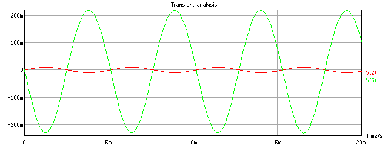
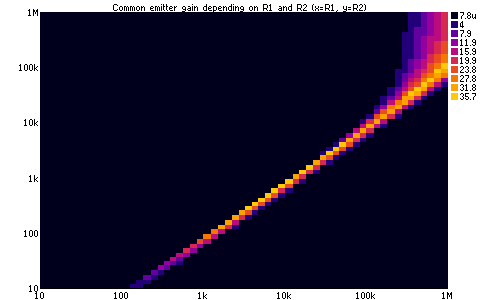

# ngspicejs
JS frontend to ngspice electronics simulation software

# Goals

- use existing ngspice simulation engine
- better glue language (JS via libv8)
- better error messages
- ability to catch stupid errors
- built-in code linter and beautifier
- web-search friendly documentation (instead of one 723-page long PDF)
- overall less frustrating user experience

# Example

```javascript
    #!/usr/bin/env ngspicejs
    // linter: ngspicejs-lint
    "use strict";

    // Simple common emitter amplifier 22x
    battery('U1', 1, 0, 9);
    sinewave('U2', 2, 0).v(0.01).f(196);
    var r1 = resistor('R1', 1, 3, '68000');
    var r2 = resistor('R2', 3, 0, '4700');
    resistor('R3', 1, 4, '20k');
    resistor('R4', 6, 0, '330');
    resistor('R5', 5, 0, '50k');
    capacitor('C1', 2, 3, '10u');
    capacitor('C2', 4, 5, '10u');
    npn('T1', 4, 3, 6, 'BC547');

    // transient analysis, chart, measure gain
    var t = tran().run().chart(['V(2)', 'V(5)']);
    t.last_chart.gif('hello_transient.gif');
    var g = t.gain(2, 5);
    echo('gain', g.toFixed(1));

    // change R1 and R2 and find maximal gain
    var x = [], y = [], gain = [], max = g;
    series_e12(10, '1M').forEach(a => {
        series_e12(10, '1M').forEach(b => {
            r1.r(a);
            r2.r(b);
            x.push(a);
            y.push(b);
            g = tran().run().gain(2, 5);
            gain.push(g);
            if (g > max) {
                max = g;
                echo('r1', a, 'r2', b, 'gain', g.toFixed(3));
            }
        });
    });

    // Show chart and save it as gif
    chart_scatter(x, y, gain)
        .title('Common emitter gain depending on R1 and R2')
        .log_x(true)
        .log_y(true)
        .label_x('R1')
        .label_y('R2')
        .size(12)
        .show()
        .gif('hello_gain.gif');
```

    

    gain 22.5
    r1 1000 r2 82 gain 23.259
    r1 1200 r2 100 gain 26.096
    r1 1500 r2 120 gain 26.986
    r1 1800 r2 150 gain 30.305
    r1 2200 r2 180 gain 31.201
    r1 2700 r2 220 gain 32.232
    r1 3300 r2 270 gain 33.296
    r1 3900 r2 330 gain 34.940
    r1 5600 r2 470 gain 35.260
    r1 390000 r2 39000 gain 35.740

    

# Requirements

    sudo apt-get install ngspice ngspice-dev libnode-dev libasound2-dev libreadline-dev

# Compilation

In ngspicejs directory run:

    make clean all

Once compiled create ~/bin folder, add it to PATH environment variable (e.g. in ~/.profile, this may require to restart the terminal) and then as a normal user run:

    make install

It will create symlinks in ~/bin that will points to ngspicejs, ngspicejs-linter and ngspicejs-beautify. Test it:

    ./hello.ngjs

If you don't see charts enable SIXEL support in your terminal.

# Sixel support (graphics in terminal)

To allow displaying sixel graphics in xterm, you need to enable sixel support first:

    echo "XTerm*decTerminalID: vt340" >> $HOME/.Xresources
    echo "XTerm*numColorRegisters: 256" >> $HOME/.Xresources
    echo "XTerm*disallowedWindowOps: 1,2,3,4,5,6,7,8,9,11,13,19,20,21,GetSelection,SetSelection,SetWinLines,SetXprop" >> $HOME/.Xresources
    xrdb $HOME/.Xresources

# API

[ngspicejs API](doc/api.md) is described in separate file. In code you can use api(anything) to print API of anything, for example:

    api(resistor);
    api(resistor());
    api(globalThis);
    api(tran);
    api(tran());

# Help

You can use built-in function help(query) to perform full text searches, for example:

    help('how to measure gain');
    help('how to do fft of an ammeter');

# More examples

- [Show that saving WAV file requires transient step 40u or lower, otherwise distortion is too high](/example/audio/tran_step_and_audio_quality.ngjs) in /example/audio
- [Common emitter + Common base with feedback](/example/bjt_high_current_output_amps/ce_cb_feedback.ngjs) in /example/bjt_high_current_output_amps
- [Push-pull amplifier driving 66R load](/example/bjt_high_current_output_amps/push_pull_amp.ngjs) in /example/bjt_high_current_output_amps
- [Sziklay pair driving same 66R load](/example/bjt_high_current_output_amps/sziklay_pair_amp.ngjs) in /example/bjt_high_current_output_amps
- [Two npn followers as blend circuit with 50k blending pot and 50k load, measure volume sag](/example/blend_circuit/blend_2x_follower.ngjs) in /example/blend_circuit
- [Three npn followers as blend circuit with 50k blending pot and 50k load, measure volume sag](/example/blend_circuit/blend_3x_follower.ngjs) in /example/blend_circuit
- [Quad opamp blend circuit with 50k blending pot and 50k load, measure volume sag](/example/blend_circuit/blend_quad_opamp.ngjs) in /example/blend_circuit
- [In emitter follower measure distortion for different input voltage and different loads](/example/blend_circuit/follower_distortion_amplitude_vs_load.ngjs) in /example/blend_circuit
- [Bootstrap amplifier 1000x gain, 2.5mA consumption, muddy AC](/example/bootstrap_amplifier/bootstrap_amplifier_1000x.ngjs) in /example/bootstrap_amplifier
- [Common base 50x amplifier driving 5k load](/example/common_base/common_base.ngjs) in /example/common_base
- [Three stage common emitter using sub_model with parameters](/example/common_emitter/common_emitter_2000x_using_sub_model.ngjs) in /example/common_emitter
- [Measure battery sensitivity of common emitter amplifier](/example/common_emitter/common_emitter_battery_sensitivity.ngjs) in /example/common_emitter
- [Common emitter using darlington npn via existing subcircuit model of TIP120](/example/common_emitter/common_emitter_darlington_existing.ngjs) in /example/common_emitter
- [Common emitter using darlington subcircuit that itself uses other model](/example/common_emitter/common_emitter_darlington_sub_using_other_models.ngjs) in /example/common_emitter
- [Common emitter using darlington npn via custom subcircuit](/example/common_emitter/common_emitter_darlington_subcircuit.ngjs) in /example/common_emitter
- [Common emitter with 24x amplification using BC547](/example/common_emitter/common_emitter.ngjs) in /example/common_emitter
- [Optimizing volume pot linearity and range in a condenser mic preamp](/example/condenser_mic_optimizing_volume_pot/condenser_mic_optimizing_volume_pot.ngjs) in /example/condenser_mic_optimizing_volume_pot
- [Mosfet_n current mirror](/example/current_mirror/mosfet_n_current_mirror.ngjs) in /example/current_mirror
- [Using current mirror as a resistor-controlled constant current source](/example/current_mirror/pnp_current_mirror.ngjs) in /example/current_mirror
- [Compare VA characteristic, timing and AC of 2 diodes](/example/diode_va/diode_va_characteristic.ngjs) in /example/diode_va
- [4-stage diode based voltage multiplier](/example/diode_voltage_multiplier/diode_voltage_multiplier.ngjs) in /example/diode_voltage_multiplier
- [Converting 22kHz 9V square wave (0-9V) to 32V using four voltage doubler subcircuits](/example/diode_voltage_multiplier/square_wave_9V_to_dc_34V.ngjs) in /example/diode_voltage_multiplier
- [Another dynamic mic preamp with npn and pnp](/example/dynamic_mic/dynamic_mic_amp_npn_pnp.ngjs) in /example/dynamic_mic
- [Using dynamic_mic device](/example/dynamic_mic/dynamic_mic_using_model.ngjs) in /example/dynamic_mic
- [Making a dumb spice model of dynamic microphone](/example/dynamic_mic/dynamic_mic.ngjs) in /example/dynamic_mic
- [Show that electret mic is passive and needs some power](/example/electret_mic/electret_mic.ngjs) in /example/electret_mic
- [This file will be included by other examples](/example/emitter_follower/emitter_follower.ngjs) in /example/emitter_follower
- [Emitter follower chart of gain by input offset for different loads](/example/emitter_follower/input_offset_and_gain.ngjs) in /example/emitter_follower
- [Changing R1 and R2 and R3 measure gain, current and thd and find the best score](/example/emitter_follower/r1_r2_r3.ngjs) in /example/emitter_follower
- [Changing R1 and R2 and measure gain, current and thd](/example/emitter_follower/r1_r2.ngjs) in /example/emitter_follower
- [Simple emitter follower test](/example/emitter_follower/simple_test.ngjs) in /example/emitter_follower
- [Emitter follower with constant current source, chart THD by input amplitude for different loads](/example/emitter_follower/thd_by_amplitude_and_load_constant_current_emitter_follower.ngjs) in /example/emitter_follower
- [Emitter follower chart THD by input amplitude for different loads](/example/emitter_follower/thd_by_amplitude_and_load.ngjs) in /example/emitter_follower
- [Active envelope follower (AM signal)](/example/envelope_follower/active_envelope_follower_am.ngjs) in /example/envelope_follower
- [Active envelope follower using opamp](/example/envelope_follower/active_envelope_follower_opamp.ngjs) in /example/envelope_follower
- [Active envelope follower (beeping signal)](/example/envelope_follower/active_envelope_follower.ngjs) in /example/envelope_follower
- [Passive envelope follower (AM signal)](/example/envelope_follower/passive_envelope_follower_am.ngjs) in /example/envelope_follower
- [Show that string throw has no stack trace](/example/exceptions/1_string_exception_uncaught.ngjs) in /example/exceptions
- [Show that exception can be caught and program continues](/example/exceptions/2_string_exception_caght.ngjs) in /example/exceptions
- [By using new Exception() the stack will be deep](/example/exceptions/3_uncaught_new_exception.ngjs) in /example/exceptions
- [By using new Error() the stack will be deep](/example/exceptions/3b_uncaught_new_error.ngjs) in /example/exceptions
- [Show how object Exceptions affect the speed compared to faster string exceptions](/example/exceptions/4_caught_new_exception.ngjs) in /example/exceptions
- [FFT of various non-trivial vectors (real inductors, ammeters, floating voltmeters)](/example/fft_of_ammeter_current/fft_of_ammeter_and_inductor_current_and_voltmeters.ngjs) in /example/fft_of_ammeter_current
- [FFT of an ammeter current](/example/fft_of_ammeter_current/fft_of_ammeter_current.ngjs) in /example/fft_of_ammeter_current
- [4-transistor amplifier for 8ohm load](/example/four_bjt_8ohm_amplifier/four_bjt_8ohm_amplifier.ngjs) in /example/four_bjt_8ohm_amplifier
- [Weird french 2 BJT amplifier](/example/french_amp/french_amp.ngjs) in /example/french_amp
- [Calculate even and odd harmonics ratios using fft](/example/harmonics/fft_even_odd.ngjs) in /example/harmonics
- [High-gain (5000x) 2-stage common emitter](/example/high_gain_ce_ce_amplifier/high_gain_ce_ce_amplifier.ngjs) in /example/high_gain_ce_ce_amplifier
- [How pickup inductance affect AC characteristic](/example/high_gain_ce_ce_amplifier/low_inductance_pickup_ac.ngjs) in /example/high_gain_ce_ce_amplifier
- [Shows how to include other files](/example/include/using_include.ngjs) in /example/include
- [Calculate BETA from Idss and Vto](/example/jfet_matcher/jfet_calculate_beta.ngjs) in /example/jfet_matcher
- [Testing different jfets in jfet matcher jig](/example/jfet_matcher/jfet_matcher.ngjs) in /example/jfet_matcher
- [Joule thief powering white LED from single 1.5V AAA battery](/example/joule_thief/joule_thief.ngjs) in /example/joule_thief
- [Maximize gain of common emitter with 3.3V battery, manually tuned to 22.1x, then optimized to 22.8x](/example/maximize_gain/maximize_gain_3V3.ngjs) in /example/maximize_gain
- [Maximize gain of common emitter, manually tuned to 217, then optimized to 224](/example/maximize_gain/maximize_gain_singlecoil.ngjs) in /example/maximize_gain
- [Maximize gain of common emitter, manually tuned to 209x, then optimized to 224x](/example/maximize_gain/maximize_gain_v2.ngjs) in /example/maximize_gain
- [Maximize gain of common emitter, manually tuned to 22.0, then optimized to 22.8x](/example/maximize_gain/maximize_gain.ngjs) in /example/maximize_gain
- [NPN Amplifier to amplify signal to measure LC ringing](/example/measure_lc_ringing/measure_lc_ringing.ngjs) in /example/measure_lc_ringing
- [Pulse-induction metal detector, after decay the output V(19) is in the middle of 3.3V range](/example/metal_detector_pi/metal_detector_pi.ngjs) in /example/metal_detector_pi
- [JFET colpitts oscillator](/example/metal_detector_transmitter/jfet_colpitts.ngjs) in /example/metal_detector_transmitter
- [20kHz colpitts oscillator using n-channel mosfet BS170 and extra resistor from gate to drain](/example/metal_detector_transmitter/mosfet_colpitts.ngjs) in /example/metal_detector_transmitter
- [Colpitts oscillator with NPN](/example/metal_detector_transmitter/npn_colpitts.ngjs) in /example/metal_detector_transmitter
- [Peltz oscillator](/example/metal_detector_transmitter/peltz.ngjs) in /example/metal_detector_transmitter
- [This is oscillator used in metal detectors by Charles D. Rakes](/example/metal_detector_transmitter/rakes.ngjs) in /example/metal_detector_transmitter
- [Oscillator from treasure witcher metal detector](/example/metal_detector_transmitter/treasure_witcher.ngjs) in /example/metal_detector_transmitter
- [Two NPN colpitts oscillator](/example/metal_detector_transmitter/two_npn_colpitts_oscillator.ngjs) in /example/metal_detector_transmitter
- [N-channel mosfet 10x amplifier with high inductance source, 50k load and reasonably flat AC](/example/mosfet_n_10x_amplifier/mosfet_n_10x_amplifier.ngjs) in /example/mosfet_n_10x_amplifier
- [Compare different mosfets for switching 5R load powered from 5V supply using only 3V3 control voltage](/example/mosfet_switching_with_3V3/mosfet_switching_with_3V3.ngjs) in /example/mosfet_switching_with_3V3
- [Using motor driver L272M](/example/motor_driver_L272M/motor_driver_L272M.ngjs) in /example/motor_driver_L272M
- [Trying to find if hFE can be measured accurately](/example/npn_characteristics/npn_measure_hfe_shared_collector_resistor.ngjs) in /example/npn_characteristics
- [Can hFE be reliably measured using 2 resistors?](/example/npn_characteristics/npn_measure_hfe_using_2_resistors.ngjs) in /example/npn_characteristics
- [Measuring hFE using opamp](/example/npn_characteristics/npn_measure_hfe_using_opamp.ngjs) in /example/npn_characteristics
- [Measure hFE using two ammeters](/example/npn_characteristics/npn_measure_hfe_with_two_ammeters.ngjs) in /example/npn_characteristics
- [Measure forward early voltage VAF](/example/npn_characteristics/npn_measure_vaf.ngjs) in /example/npn_characteristics
- [Show Ic/Vce in chart_xy with multiple series in one chart](/example/npn_characteristics/npn_measure_vce_ic_using_current_source_chart.ngjs) in /example/npn_characteristics
- [Measure Vce:Ic characteristic of NPN transistor using current source](/example/npn_characteristics/npn_measure_vce_ic_using_current_source.ngjs) in /example/npn_characteristics
- [NPN phase splitter](/example/npn_phase_splitter/npn_phase_splitter.ngjs) in /example/npn_phase_splitter
- [Testing DC coupled gain using opamp and single supply](/example/opamp_dc_gain/opamp_dc_gain_single_supply.ngjs) in /example/opamp_dc_gain
- [Testing DC coupled gain using opamp, symmetrical supply](/example/opamp_dc_gain/opamp_dc_gain_symmetrical_supply.ngjs) in /example/opamp_dc_gain
- [Differential opamp is less susceptible to common mode noise](/example/opamp_diff_amp_common_mode_noise/opamp_diff_amp_common_mode_noise.ngjs) in /example/opamp_diff_amp_common_mode_noise
- [Show usage of voltmeter for measuring between 2 nodes](/example/opamp_differential_amplifier_floating_input/opamp_differential_amplifier_floating_input.ngjs) in /example/opamp_differential_amplifier_floating_input
- [Dual opamp voltage controlled current source, voltage = 0-2.5V, current=0-25mA](/example/opamp_howland_current_pump/dual_opamp_vccs.ngjs) in /example/opamp_howland_current_pump
- [Opamp howland current pump](/example/opamp_howland_current_pump/opamp_howland_current_pump.ngjs) in /example/opamp_howland_current_pump
- [Single opamp as vccs, p-channel mosfet and grounded load](/example/opamp_howland_current_pump/opamp_vccs_mosfet_p.ngjs) in /example/opamp_howland_current_pump
- [Voltage controlled current source using sensing resistor](/example/opamp_howland_current_pump/opamp_vccs_sensing_resistor.ngjs) in /example/opamp_howland_current_pump
- [3-opamp instrumentation amplifier, gain controlled by single resistor R2](/example/opamp_instrumentation_amplifier/opamp_instrumentation_amplifier.ngjs) in /example/opamp_instrumentation_amplifier
- [Testing DC coupled gain using opamp](/example/opamp_piezo_buffer/opamp_piezo_buffer.ngjs) in /example/opamp_piezo_buffer
- [Summing 100Hz and 700Hz sinewave using opamp](/example/opamp_summing_amplifier/opamp_summing_amplifier.ngjs) in /example/opamp_summing_amplifier
- [Opamp with virtual ground made of resistor divider and caps](/example/opamp_virtual_ground/opamp_virtual_ground.ngjs) in /example/opamp_virtual_ground
- [Use 3.3V to switch 150R load using BJT, optimize values of R1,R2,R3 to have maximal on current and minimal off current](/example/optimize_bjt_switch/optimize_bjt_switch.ngjs) in /example/optimize_bjt_switch
- [Pedal alembic stratoblaster, output, ac, pot sweep (thd and gain)](/example/pedal_alembic_stratoblaster/pedal_alembic_stratoblaster.ngjs) in /example/pedal_alembic_stratoblaster
- [Pedal AMZ mosfet booster](/example/pedal_amz_mosfet_booster/pedal_amz_mosfet_booster.ngjs) in /example/pedal_amz_mosfet_booster
- [Show how resistor value affects sustain with NPN and darlington](/example/pedal_bazz_fuss_sustain/pedal_bazz_fuss_sustain.ngjs) in /example/pedal_bazz_fuss_sustain
- [Pedal dallas rangemaster treble boost](/example/pedal_dallas_rangemaster_treble_boost/pedal_dallas_rangemaster_treble_boost.ngjs) in /example/pedal_dallas_rangemaster_treble_boost
- [Guitar pedal "Electra distortion" with original 1N4148+1N34A vs 1N4148+1N4148](/example/pedal_electra_distortion/pedal_electra_distortion.ngjs) in /example/pedal_electra_distortion
- [FFT with beta-correct AC128s and comparison with two identical 2N3906](/example/pedal_fuzz_face/pedal_fuzz_face_correct_beta_AC128.ngjs) in /example/pedal_fuzz_face
- [Observing THD of fuzz face pedal with changes in pot P1 position](/example/pedal_fuzz_face/pedal_fuzz_face_pot1_thd.ngjs) in /example/pedal_fuzz_face
- [Save output of fuzz face to wav file](/example/pedal_fuzz_face/pedal_fuzz_face_save_audio.ngjs) in /example/pedal_fuzz_face
- [Pedal harmonic percolator, measuring correct CE voltages](/example/pedal_harmonic_percolator/pedal_harmonic_percolator.ngjs) in /example/pedal_harmonic_percolator
- [Pedal metal simplex, sweep pot 1 and pot 2 and show THD in 2D colored chart](/example/pedal_metal_simplex/pedal_metal_simplex.ngjs) in /example/pedal_metal_simplex
- [Decent octave up pedal with input jfet buffer](/example/pedal_octaver/pedal_decent_octave_up_with_jfet_buffer.ngjs) in /example/pedal_octaver
- [Dan Armstrong Green Ringer octaver](/example/pedal_octaver/pedal_green_ringer.ngjs) in /example/pedal_octaver
- [Octave pedal made of 4 ideal diodes](/example/pedal_octaver/pedal_octaver_ideal.ngjs) in /example/pedal_octaver
- [Pedal opamp fuzz and THD related to R2 value](/example/pedal_opamp_fuzz/pedal_opamp_fuzz.ngjs) in /example/pedal_opamp_fuzz
- [Opamp based narrow band pass filter without inductor](/example/pedal_opamp_inductorless_wah/pedal_opamp_inductorless_wah.ngjs) in /example/pedal_opamp_inductorless_wah
- [Jfet preamp with strange LC network across source resistor and corresponding weird AC](/example/pedal_ovation_preamp/pedal_ovation_preamp.ngjs) in /example/pedal_ovation_preamp
- [Pedal peppermill and sweep of P1 and P2 pot and corresponding THD](/example/pedal_peppermill/pedal_peppermill.ngjs) in /example/pedal_peppermill
- [Pedal Anderton Wah-Antiwah - filter has two peaks, one is going down, second is going up](/example/pedal_wah/pedal_anderton_wah_antiwah.ngjs) in /example/pedal_wah
- [Pedal bespeco weeper wah, AC and pot sweep vs peak frequency](/example/pedal_wah/pedal_bespeco_weeper_wah.ngjs) in /example/pedal_wah
- [Pedal colorsound wah](/example/pedal_wah/pedal_colorsound_wah.ngjs) in /example/pedal_wah
- [Pedal crybaby wah](/example/pedal_wah/pedal_crybaby_wah.ngjs) in /example/pedal_wah
- [Pedal maestro boomerang wah wah](/example/pedal_wah/pedal_maestro_boomerang_wah_wah.ngjs) in /example/pedal_wah
- [Pedal VOX Wah 847](/example/pedal_wah/pedal_vox_wah_v847.ngjs) in /example/pedal_wah
- [Pedal wah filter](/example/pedal_wah/pedal_wah_filter.ngjs) in /example/pedal_wah
- [Pedal wox wah swell and peak frequency by pot position](/example/pedal_wah/pedal_wox_wah_swell.ngjs) in /example/pedal_wah
- [Guitar pickup clamped by two antiparallel diodes to get some distortion](/example/pickup_and_two_antiparallel_diodes/pickup_and_two_antiparallel_diodes.ngjs) in /example/pickup_and_two_antiparallel_diodes
- [Piezo pickup 40x jfet amplifier](/example/piezo_pickup_amplifier/piezo_pickup_and_40x_jfet_amplifier.ngjs) in /example/piezo_pickup_amplifier
- [Piezo pickup 40x amplifier](/example/piezo_pickup_amplifier/piezo_pickup_and_40x_mosfet_amplifier.ngjs) in /example/piezo_pickup_amplifier
- [Piezo pickup with mosfet source follower as input buffer](/example/piezo_pickup_amplifier/piezo_pickup_and_mosfet_source_follower.ngjs) in /example/piezo_pickup_amplifier
- [Piezo pickup and sziklai follower](/example/piezo_pickup_amplifier/piezo_pickup_and_sziklai_follower.ngjs) in /example/piezo_pickup_amplifier
- [Measure PNP's hFE](/example/pnp_characteristics/pnp_measure_hfe.ngjs) in /example/pnp_characteristics
- [Convert NPN common emitter to PNP common emitter with these 2 simple tricks](/example/pnp_common_emitter/pnp_common_emitter.ngjs) in /example/pnp_common_emitter
- [Switching between different PNP and observing gain](/example/pnp_common_emitter/pnp_different_BD136_models.ngjs) in /example/pnp_common_emitter
- [How linear pot curve changes when parallel resistor is placed across pot](/example/pot_curves/pot_curves_parallel_resistor.ngjs) in /example/pot_curves
- [Using single pulse source](/example/pulse_source/single_pulse.ngjs) in /example/pulse_source
- [Piece-wise linear source](/example/pwl_source/pwl_source.ngjs) in /example/pwl_source
- [AC analysis of ideal and real LC circuit](/example/quality_of_lc_filter/quality_of_lc_filter.ngjs) in /example/quality_of_lc_filter
- [Ripple rejection circuit using NPN as "capacitance multiplier"](/example/ripple_rejection_using_npn/ripple_rejection_using_npn.ngjs) in /example/ripple_rejection_using_npn
- [Sallen-key filter monte carlo parameter optimization](/example/sallen_key_monte_carlo/sallen_key_monte_carlo.ngjs) in /example/sallen_key_monte_carlo
- [Amplitude modulated voltage source](/example/signal_sources/am.ngjs) in /example/signal_sources
- [Beeping voltage supply](/example/signal_sources/beeps.ngjs) in /example/signal_sources
- [Single pulse supply](/example/signal_sources/pulse.ngjs) in /example/signal_sources
- [Sawtooth supply](/example/signal_sources/sawtooth.ngjs) in /example/signal_sources
- [Sinewave supply](/example/signal_sources/sinewave.ngjs) in /example/signal_sources
- [Square wave supply](/example/signal_sources/square.ngjs) in /example/signal_sources
- [BJT emitter follower with low input inpedance is muddy](/example/singlecoil_pickup_ac/bjt_follower_muddy.ngjs) in /example/singlecoil_pickup_ac
- [BJT emitter follower with high input inpedance and 14uA consumption](/example/singlecoil_pickup_ac/bjt_follower_with_high_input_impedance.ngjs) in /example/singlecoil_pickup_ac
- [JFET source follower has much flatter AC than BJTs](/example/singlecoil_pickup_ac/jfet_follower.ngjs) in /example/singlecoil_pickup_ac
- [Find C0 and L0 of a singlecoil pickup from frequency responses measured using different bypass capacitors](/example/singlecoil_pickup_ac/measure_C0_and_L0.ngjs) in /example/singlecoil_pickup_ac
- [Response of LC filter to square wave signal (the "ringing")](/example/square_wave_and_lc_filter/square_wave_and_lc_filter.ngjs) in /example/square_wave_and_lc_filter
- [Square wave signal](/example/square_wave_signal/square_wave_signal.ngjs) in /example/square_wave_signal
- [Show using switch timeline feature where switch states are defined for different times](/example/switch/switch_1p2t_timeline.ngjs) in /example/switch
- [Switching between 2 different resistors using 1P2T switch changes the current](/example/switch/switch_1p2t.ngjs) in /example/switch
- [Three phase astable multivibrator](/example/three_phase_oscillator/three_phase_oscillator.ngjs) in /example/three_phase_oscillator
- [Transformer from 230V to 12V](/example/transformer/transformer_230V_to_12V.ngjs) in /example/transformer
- [Using TL431 to turn on low-battery indicator](/example/undervoltage_protection/low_battery_indicator.ngjs) in /example/undervoltage_protection
- [Using TL431_2 as 2.5V reference](/example/undervoltage_protection/TL431_2_as_2V5_ref.ngjs) in /example/undervoltage_protection
- [Using TL431 as 2.5V reference](/example/undervoltage_protection/TL431_as_2V5_ref.ngjs) in /example/undervoltage_protection
- [3.7V undervoltage protection using P-channel mosfet transistor and TL431 voltage reference](/example/undervoltage_protection/undervoltage_protection_mosfet_p.ngjs) in /example/undervoltage_protection
- [3.7V undervoltage protection using PNP transistor and TL431 voltage reference](/example/undervoltage_protection/undervoltage_protection_pnp.ngjs) in /example/undervoltage_protection
- [Using existing subckt model](/example/using_subckt_model/using_subckt_model.ngjs) in /example/using_subckt_model
- [Using voltmeter to measure voltage of capacitor and inductor in RLC circuit](/example/voltmeter/ac_rlc.ngjs) in /example/voltmeter
- [Using voltmeter in transient analysis to measure average voltage](/example/voltmeter/tran_average_voltage.ngjs) in /example/voltmeter
- [Using voltmeter in transient analysis](/example/voltmeter/tran_divider.ngjs) in /example/voltmeter
- [White noise generator using unconnected collector on NPN transistor](/example/white_noise_generator_npn/white_noise_generator_npn.ngjs) in /example/white_noise_generator_npn
- [Find model attributes for the zener diode C9V1ST from the measured reverse voltage and current values](/example/zener_diode_model_maker/find_model_zener_2V4.ngjs) in /example/zener_diode_model_maker
- [Find model attributes for the zener diode C9V1ST from the measured reverse voltage and current values](/example/zener_diode_model_maker/find_model_zener_9V1.ngjs) in /example/zener_diode_model_maker
- [Draw V-A curve using ZENER_C2V4ST model from the model/DIODE/ZENER_C2V4ST.sub](/example/zener_diode_model_maker/zener_test_model_2V4.ngjs) in /example/zener_diode_model_maker
- [Draw V-A curve using ZENER_C9V1ST model from the model/DIODE/ZENER_C9V1ST.sub](/example/zener_diode_model_maker/zener_test_model_9V1.ngjs) in /example/zener_diode_model_maker
- [How to use small singal AC analysis](/howto/ac/how_to_use_ac_analysis.ngjs) in /howto/ac
- [How to use AM source (amplitude modulation)](/howto/am/how_to_use_am.ngjs) in /howto/am
- [How to use ammeter](/howto/ammeter/how_to_use_ammeter.ngjs) in /howto/ammeter
- [How to find peak frequency in AC data](/howto/arrays/how_to_find_peak_frequency_in_ac_data.ngjs) in /howto/arrays
- [How to remove previously set device attribute](/howto/attributes/how_to_remove_previously_set_attribute.ngjs) in /howto/attributes
- [How to use wav audio source](/howto/audio/how_to_use_wav_source.ngjs) in /howto/audio
- [How to write .m sample file](/howto/audio/how_to_write_sample_file.ngjs) in /howto/audio
- [How to use battery sensitivity analysis](/howto/battery_sensitivity/how_to_use_battery_sensitivity_analysis.ngjs) in /howto/battery_sensitivity
- [How to set battery internal resistance](/howto/battery/how_to_set_battery_internal_resistance.ngjs) in /howto/battery
- [How to use beeping source](/howto/beeps/how_to_use_beeping_source.ngjs) in /howto/beeps
- [How to use capacitor](/howto/capacitor/how_to_use_real_capacitor.ngjs) in /howto/capacitor
- [How to use current controlled current source](/howto/cccs/how_to_use_cccs.ngjs) in /howto/cccs
- [How to use current controlled voltage source](/howto/ccvs/how_to_use_ccvs.ngjs) in /howto/ccvs
- [How to make scatter chart](/howto/chart_scatter/how_to_use_scatter_chart.ngjs) in /howto/chart_scatter
- [How to make XY chart from custom data](/howto/chart_xy/how_to_make_xy_chart_from_custom_data.ngjs) in /howto/chart_xy
- [How to use XY chart](/howto/chart_xy/how_to_use_chart_xy.ngjs) in /howto/chart_xy
- [How to use current source](/howto/current_source/how_to_use_current_source.ngjs) in /howto/current_source
- [How to change diode model](/howto/diode/how_to_change_diode_model.ngjs) in /howto/diode
- [How to change diode parameters](/howto/diode/how_to_change_diode_parameters.ngjs) in /howto/diode
- [How to use diode](/howto/diode/how_to_use_diode.ngjs) in /howto/diode
- [How to use dynamic mic](/howto/dynamic_mic/how_to_use_dynamic_mic.ngjs) in /howto/dynamic_mic
- [How to use electret mic](/howto/electret_mic/how_to_use_electret_mic.ngjs) in /howto/electret_mic
- [How to use engineering prefixes](/howto/eng/how_to_use_engineering_prefixes.ngjs) in /howto/eng
- [How to do FFT of a current running through ammeter](/howto/fft/how_to_do_fft_of_a_current_through_ammeter.ngjs) in /howto/fft
- [How to do FFT](/howto/fft/how_to_do_fft.ngjs) in /howto/fft
- [How to use pnp](/howto/how_to_use_pnp/how_to_use_pnp.ngjs) in /howto/how_to_use_pnp
- [How to use inductor](/howto/inductor/how_to_use_inductor.ngjs) in /howto/inductor
- [How to use inductor coupling with ugly inductor names](/howto/inductor/inductor_coupling_using_ugly_name.ngjs) in /howto/inductor
- [How to use jfet](/howto/jfet_n/how_to_use_jfet.ngjs) in /howto/jfet_n
- [How to print all available models](/howto/model/how_to_print_all_available_models.ngjs) in /howto/model
- [How to use bjt model](/howto/model/how_to_use_bjt_model.ngjs) in /howto/model
- [How to use diode model](/howto/model/how_to_use_diode_model.ngjs) in /howto/model
- [How to use jfet model](/howto/model/how_to_use_jfet_model.ngjs) in /howto/model
- [How to use mos model](/howto/model/how_to_use_mos_model.ngjs) in /howto/model
- [How to use resistor model](/howto/model/how_to_use_resistor_model.ngjs) in /howto/model
- [How to use spice model](/howto/model/how_to_use_spice_model.ngjs) in /howto/model
- [How to use vdmos model](/howto/model/how_to_use_vdmos_model.ngjs) in /howto/model
- [How to use mosfet](/howto/mosfet_n/how_to_use_mosfet.ngjs) in /howto/mosfet_n
- [How to print ngspice netlist](/howto/netlist/how_to_print_netlist.ngjs) in /howto/netlist
- [How to print ngspice commands](/howto/netlist/how_to_print_ngspice_commands.ngjs) in /howto/netlist
- [How to use npn](/howto/npn/how_to_use_npn.ngjs) in /howto/npn
- [How to make dual opamp DIP8 subcircuit](/howto/opamp/how_to_make_dual_opamp.ngjs) in /howto/opamp
- [How to use pickup](/howto/pickup/how_to_use_pickup.ngjs) in /howto/pickup
- [How to use potentiometer](/howto/pot/how_to_use_potentiometer.ngjs) in /howto/pot
- [How to use pulse source](/howto/pulse/how_to_use_pulse_source.ngjs) in /howto/pulse
- [How to use piece-wise linear source (pwl)](/howto/pwl/how_to_use_pwl_source.ngjs) in /howto/pwl
- [How to use resistor](/howto/resistor/how_to_use_resistor.ngjs) in /howto/resistor
- [How to use sawtooth voltage source](/howto/sawtooth/how_to_use_sawtooth_voltage_source.ngjs) in /howto/sawtooth
- [How to make a sinusoidal signal generator?](/howto/sinewave/how_to_make_a_sinusoidal_signal_generator.ngjs) in /howto/sinewave
- [How to use spice directly](/howto/spice/how_to_use_spice_directly.ngjs) in /howto/spice
- [How to use square voltage source](/howto/square/how_to_use_square_voltage_source.ngjs) in /howto/square
- [How to make a subcircuit with equations](/howto/sub/how_to_make_a_subcircuit_with_equations.ngjs) in /howto/sub
- [How to make a subcircuit](/howto/sub/how_to_make_a_subcircuit.ngjs) in /howto/sub
- [How to use subcircuit](/howto/sub/how_to_use_subcircuit.ngjs) in /howto/sub
- [How to control 1P2T switch using timeline, how to set on and off resistance](/howto/switch_1p2t/how_to_use_switch_1p2t.ngjs) in /howto/switch_1p2t
- [How to do transient analysis](/howto/tran/how_to_do_tran.ngjs) in /howto/tran
- [How to estimate frequency in tran data](/howto/tran/how_to_estimate_frequency_in_tran_data.ngjs) in /howto/tran
- [How to use voltage controlled current source vccs](/howto/vccs/how_to_use_vccs.ngjs) in /howto/vccs
- [How to use voltage controlled voltage source vcvs with poly](/howto/vcvs/how_to_use_vcvs_poly.ngjs) in /howto/vcvs
- [How to use voltage controlled voltage source vcvs](/howto/vcvs/how_to_use_vcvs.ngjs) in /howto/vcvs
- [How to measure average voltage using voltmeter in ngspicejs](/howto/voltmeter/how_to_measure_average_voltage_using_voltmeter.ngjs) in /howto/voltmeter
- [How to measure maximal voltage using voltmeter in ngspicejs](/howto/voltmeter/how_to_measure_maximal_voltage_using_voltmeter.ngjs) in /howto/voltmeter
- [How to measure minimal voltage using voltmeter](/howto/voltmeter/how_to_measure_minimal_voltage_using_voltmeter.ngjs) in /howto/voltmeter
- [How to measure voltage swing using voltmeter](/howto/voltmeter/how_to_measure_voltage_swing_using_voltmeter.ngjs) in /howto/voltmeter
- [How to set voltmeter internal resistance](/howto/voltmeter/how_to_set_voltmeter_resistance.ngjs) in /howto/voltmeter
- [How to use floating voltmeter that is not connected to ground](/howto/voltmeter/how_to_use_floating_voltmeter.ngjs) in /howto/voltmeter
- [How to use voltage reference vref](/howto/vref/how_to_use_vref.ngjs) in /howto/vref

# Support

You can support development on [Patreon](https://www.patreon.com/DusanHalicky)

